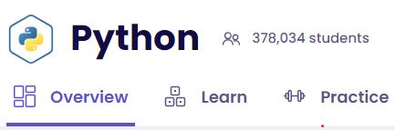
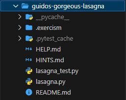
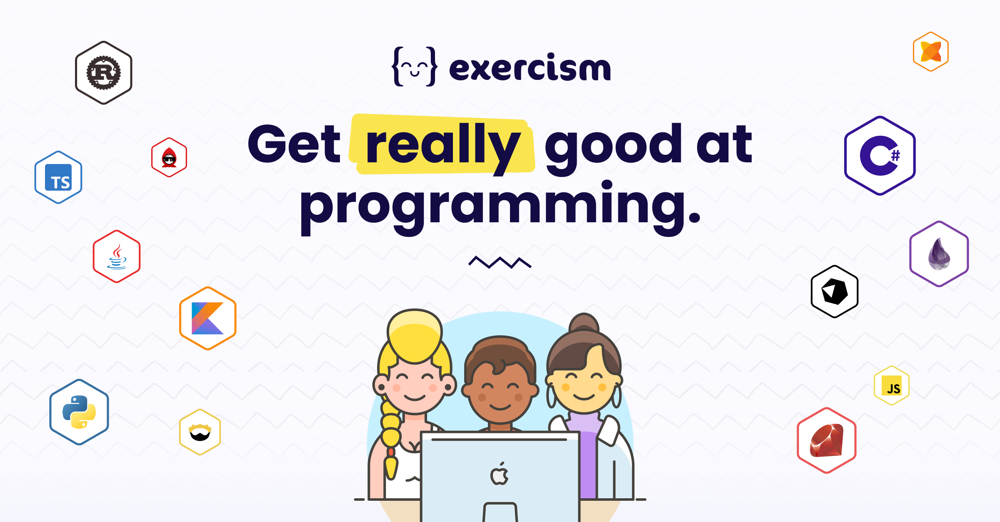

# Python Exercises

  

This repository contains a collection of Python exercises, ranging from basic concepts to more advanced topics like functions and classes.  
The exercises were sourced from [Exercism](https://exercism.org/tracks/python) and serve as an excellent opportunity for me to practice and enhance my Python programming skills.  
I really recommend this site for everyone who want to practice any language programming!

## About

The exercises are organized in individual folders, each representing specific problem categories. The primary goal of this repository is to provide a central location for my practice, track my progress, and demonstrate my Python programming skills.  
Credit to [Exercism](https://exercism.org/tracks/python) for the original exercises.

## How to Use

Feel free to explore the exercises in this repository.  
Each exercise has a Readme file with explanations about what need to be done. Also, there are 2 files with the same name as the folder: One .py and the other _test.py: The first one is My solution for the exercise, and the other is used by PyTest in order to check and validate your answer.
- `Readme.md`: Is the Exercise Explanation 
- `folder_name.py`: Is My solution for the exercise
- `folder_name_test.py`: Is the file used by PyTest in order to check my solution
- `Help`: There are Links for configure the Pytest and submit theexercise for valitation in the Site
- `Hint`: Some exercises have a Hints file, which gives more information about the topic e resolution.

## License

This project is distributed under the [MIT License](LICENSE). Feel free to use, modify, and share the exercises as desired. 
Enjoy practicing and learning with the Python exercises in this repository!  

Enjoy practicing and learning with the Python exercises in this repository!
